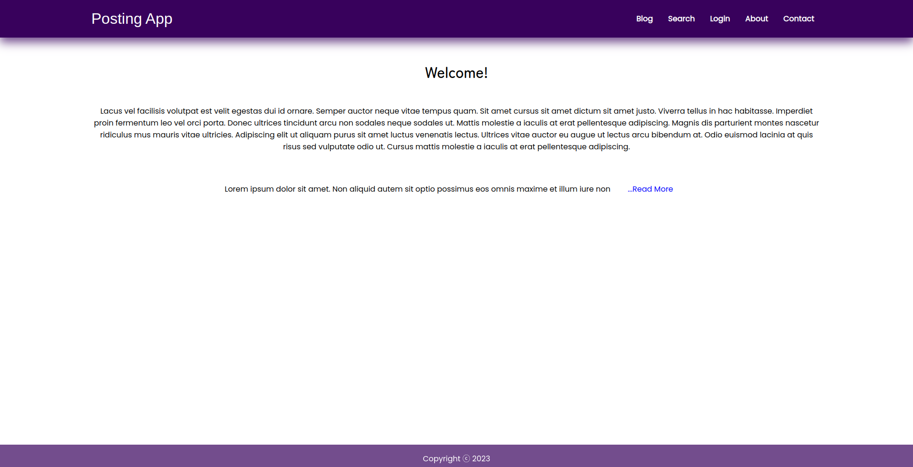
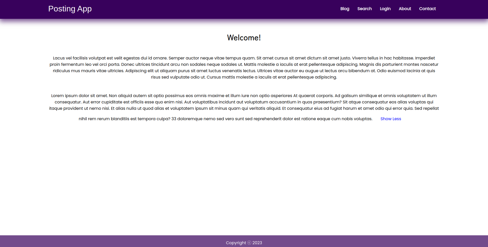
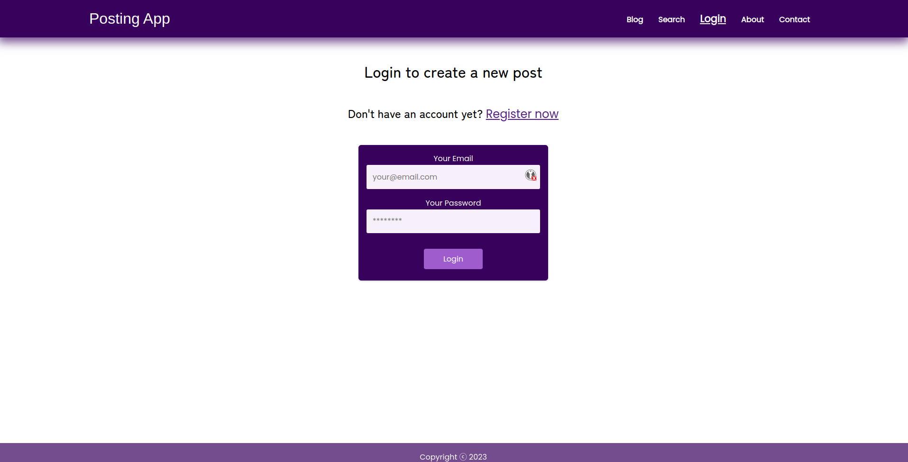
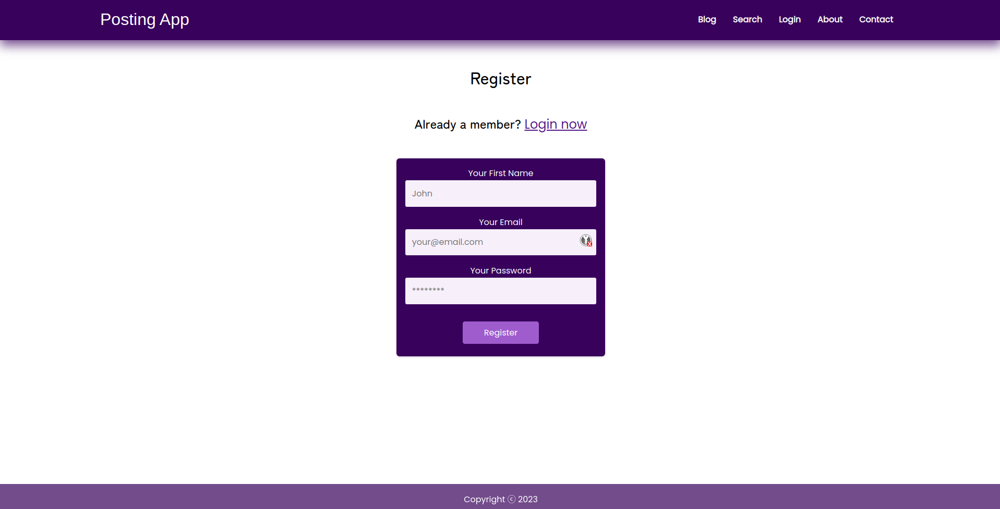
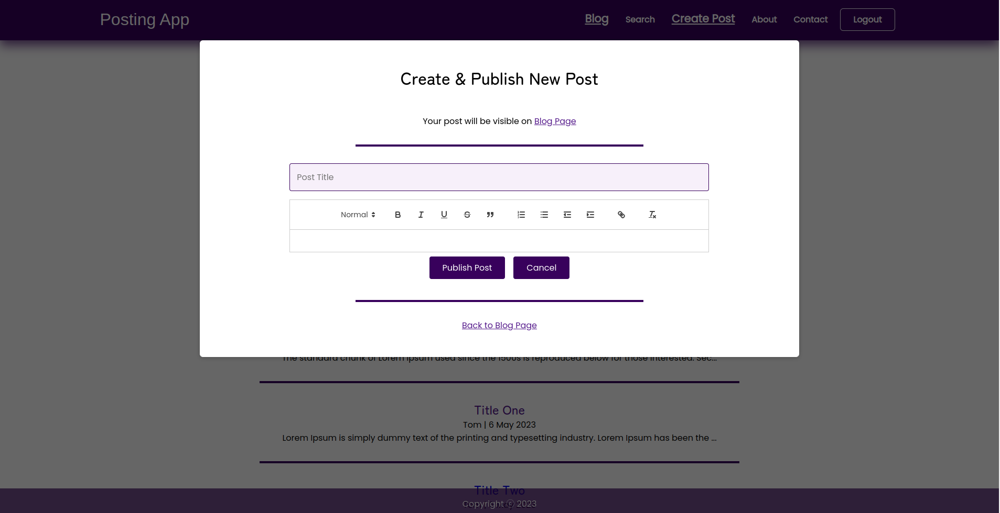
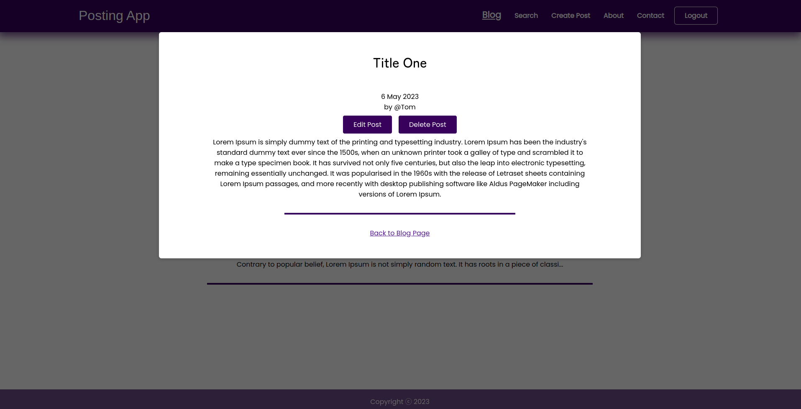
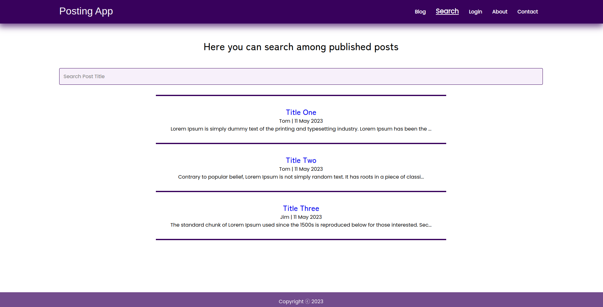

# Posting App - Front End

**Frontend** (React) - **Backend** (Node.js, Express) - **Database** (MongoDB)

- [**Find backend here**](https://github.com/beatanemeth/posting-app-back-end)

---

## How does it work?

User publishies a post (title and content) and it appears on the blog page.
After login, the user can open a single blog post from Blog page - when clicking on the post title -, and then click on edit or delete button.

Functionalities:

- publish post or cancel
- delete post
- edit post or cancel
- search posts
- open individual post in single post page
- read more / less
- register
- login
- logout
- conditional content rendering depending on login status

---

## Technical Details

### Node verison used:

- v18.12.0

### Check for dependencies:

- open **package.json** file

### How to install dependencies:

- open Terminal or Command Prompt
- change to working directory (where the file is located)  
  `$ cd /path/to/directory`
- install dependences  
  `$ npm install`

### How to use:

#### Run frontend server

- open Terminal or Command Prompt
- change to working directory (where the file is located)  
  `$ cd /path/to/directory`  
  `$ npm start`
- the Browser will open automatically at **localhost:3000**
- for more on React see [React Docs](https://reactjs.org/docs/getting-started.html)
- when finished with work stop the server  
  `ctrl+C`

#### Run backend server

- **frontend** starts on **localhost:3000** and makes request to **backend** on **localhost:8000**

---

## Page Snapshots

